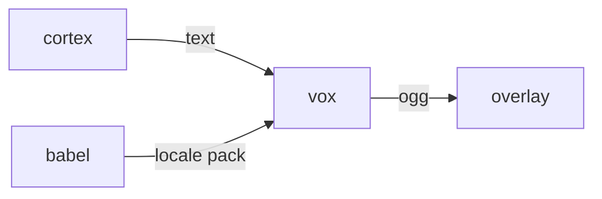

# Vox

**TTS Voice Synth** — Text-to-speech engine for unique, procedurally generated pet voices.

Part of [ComputerPets](https://github.com/RicheyWorks/computerpets). Map: [computerpets-ecosystem](https://github.com/RicheyWorks/computerpets-ecosystem).

| | |
| --- | --- |
| Status | Design scaffold — contract frozen, implementation next |
| License | MIT |
| First pet | Still [Rui on the desktop](https://github.com/RicheyWorks/computerpets/blob/main/docs/START-HERE.md). This organ is optional. |

## The job

210 kinds cannot share one narrator. Vox maps species → timbre, pitch envelope, and chirp grammar so Rui, Paint, and Reed never sound like the same actor.

The flagship overlay already puts a living sticker on the real desktop (Rui first, 210 kinds). Vox does not replace that. It is one organ.

## Who uses it

Overlay and Encore. Cortex supplies text; Vox supplies sound.

## What it is not

Not a celebrity-voice cloner. Not a music mastering suite.

## Architecture



## Stack

Python 3.12 · Piper / Coqui XTTS · CUDA when present · FastAPI audio stream · species voice banks

GroupId / namespace: `com.enterprisepet.vox`  
Default listen: `8092`

## Contract

### Data

`VoiceBank(speciesId, f0, formants, grain) · UtteranceAudio(id, ogg, durationMs)`

### Surface

- POST /v1/utter — {petId, text, emotion} → audio/ogg stream
- GET /v1/voicebank/{speciesId} — pitch, speed, phoneme map
- POST /v1/preview — 2-second sample for Creator Studio

### Failure doctrine

GPU missing → CPU Piper, slower, still works. Unknown glyph → skip, do not crash. Queue overflow → drop oldest, keep newest line.

## First slice

Build this and stop. Do not boil the ocean.

**Piper CPU path for Rui + one emotion. OGG stream from `POST /v1/utter`.**

You know it works when: Rui and Reed do not share f0. No GPU: still speaks, slower. Unknown glyph: skip, no crash.

## Environment

`VOX_DEVICE=cuda|cpu`, `VOICEBANK_DIR`

Never commit secrets. Never put Steam or chain keys in the overlay.

## Neighbors

- computerpets-cortex (text in)
- computerpets desktop (audio out)
- computerpets-babel (locale voice packs)

## Layout

```
computerpets-vox/
  README.md           this file
  LICENSE             MIT
  docs/CONTRACT.md    the same contract, frozen for implementers
  src/                implementation lands here
```

## Run (Windows)

PowerShell, from this folder, after the flagship helpers (Git, Node LTS 22+, JDK 21 as needed):

```powershell
python -m venv .venv; pip install -e .[gpu]; uvicorn vox.app:app --port 8092
```

You do not need this service to meet Rui. The [flagship start-here](https://github.com/RicheyWorks/computerpets/blob/main/docs/START-HERE.md) is still the first pet.

## Links

- Flagship: [RicheyWorks/computerpets](https://github.com/RicheyWorks/computerpets)
- This repo: [RicheyWorks/computerpets-vox](https://github.com/RicheyWorks/computerpets-vox)
- Map: [RicheyWorks/computerpets-ecosystem](https://github.com/RicheyWorks/computerpets-ecosystem)
- Contract file: [docs/CONTRACT.md](docs/CONTRACT.md)

## License

MIT. See [LICENSE](LICENSE).

---

*Two hundred ten living kinds. Keep them so a line does not go quiet.*
